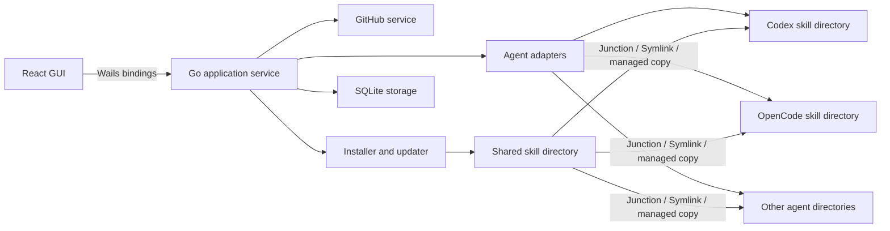

# Agent Skill Manager 技术方案

## 1. 项目概述

Agent Skill Manager 是一个面向 Windows 和 macOS 的开源桌面应用，用于从 GitHub 安装、更新和回滚 Agent Skill，并将同一份 Skill 共享给多个本地 Agent 使用。

核心目标是：

> 用户只安装一次 GitHub Skill，所有已启用的 Agent 都能使用；更新一次，所有 Agent 同步生效，同时不影响各 Agent 原有的 Skill。

## 2. 第一版范围

### 2.1 包含功能

- 使用桌面 GUI 完成所有操作，不提供 CLI。
- 从公开 GitHub 仓库或仓库子目录安装 Skill。
- 扫描仓库中的一个或多个 `SKILL.md`。
- 将 Skill 安装到用户自定义的共享目录。
- 检测并启用 Codex、OpenCode 等 Agent。
- 已启用的 Agent 自动获得全部共享 Skill。
- 检查 GitHub Release、Tag 或 Commit 更新。
- 支持手动更新、卸载和回滚。
- 支持迁移共享 Skill 目录并重建 Agent 链接。
- 检测目录冲突、失效链接和权限问题。

### 2.2 不包含功能

- 不管理 Agent 原有或专属的 Skill。
- 不覆盖 Agent 目录中已经存在的同名内容。
- 不支持 Skill 市场、评分、评论和账号体系。
- 不支持云同步。
- 不支持私有 GitHub 仓库、SSH 和 Git 凭据。
- 不自动执行 Skill 仓库中的脚本。
- 不做应用自身的自动更新。
- 第一版不处理代码签名和 macOS 公证。

## 3. 核心概念

### 3.1 共享 Skill

共享 Skill 只在共享目录中保存一份。应用通过 Junction、Symlink 或托管复制，将它暴露给所有已启用 Agent。

“共享”表示本机多个 Agent 共用，与 GitHub 仓库是公开还是私有无关。

### 3.2 Agent 原有 Skill

Agent 原有 Skill 是用户或 Agent 自己维护的内容。Agent Skill Manager 不读取其业务内容，不更新、不覆盖、不删除，只检查目标名称是否冲突。

### 3.3 已启用 Agent

用户在 Agent 管理页面启用某个 Agent 后：

- 当前所有共享 Skill 会连接到该 Agent。
- 后续安装的共享 Skill 会自动连接到该 Agent。
- 禁用 Agent 时，只移除本应用创建的链接或托管副本。

## 4. 技术选型

| 领域 | 技术 | 用途 |
| --- | --- | --- |
| 桌面框架 | Wails 当前稳定版 | Go 与 Web GUI 集成、桌面打包 |
| 后端 | Go | GitHub、文件系统、安装、更新和平台能力 |
| 前端 | React + TypeScript + Vite | 桌面 GUI |
| 状态管理 | Zustand | 前端状态管理 |
| UI 基础 | Tailwind CSS + Radix UI | 样式和可访问交互组件 |
| 图标 | Lucide React | 桌面操作图标 |
| 数据库 | `modernc.org/sqlite` | 无 CGO 的本地状态存储 |
| GitHub | `google/go-github` | 仓库、Release、Tag 和 Commit 查询 |
| 版本比较 | `Masterminds/semver` | 语义化版本解析和比较 |
| 并发锁 | `gofrs/flock` | 防止并发安装、更新和迁移 |
| 日志 | `log/slog` | 结构化本地日志 |
| 测试 | Go testing + Vitest + Playwright | 后端、前端和关键流程测试 |

最终用户不需要安装 Git、Node.js、Python 或其他运行时。Node.js 只用于开发和构建前端。

## 5. 总体架构



React 只负责展示和交互，不直接访问文件系统。下载、解压、校验、数据库和链接操作全部由 Go 后端完成。

## 6. 代码目录规划

```text
agent-skill-manager/
  main.go
  app.go
  go.mod
  wails.json

  internal/
    agents/
      adapter.go
      registry.go
      codex.go
      opencode.go
    github/
      client.go
      parser.go
      releases.go
    installer/
      install.go
      update.go
      rollback.go
      uninstall.go
      migrate.go
    platform/
      platform.go
      windows.go
      darwin.go
    skills/
      scanner.go
      validator.go
      identity.go
    storage/
      database.go
      migrations.go
      repositories.go
    security/
      archive.go
      checksum.go
      paths.go
    models/

  frontend/
    src/
      components/
      pages/
      stores/
      services/
      types/

  build/
    windows/
    darwin/

  tests/
```

## 7. 本地目录设计

用户首次启动时选择共享目录，例如：

```text
Windows: D:\AgentSkills
macOS:   /Users/alice/AgentSkills
```

共享目录内部结构：

```text
AgentSkills/
  packages/
    github.com/
      owner/
        repository/
          skill-path/
            commit-a/
              SKILL.md
            commit-b/
              SKILL.md

  .manager/
    state.db
    cache/
    locks/
    logs/
```

Skill 版本目录不可变。数据库记录当前启用的版本，各 Agent 的链接直接指向同一个版本目录。

应用自身配置只保存共享目录位置和界面设置：

```text
Windows: %LOCALAPPDATA%\AgentSkillManager
macOS:   ~/Library/Application Support/AgentSkillManager
```

## 8. Skill 身份与版本

### 8.1 Skill ID

Skill 不能只使用显示名称作为唯一标识，内部 ID 使用：

```text
github.com/{owner}/{repository}/{skill-path}
```

这样可以避免不同仓库中同名 Skill 发生身份冲突。

### 8.2 版本识别

版本优先级：

```text
SemVer Release/Tag > 普通 Tag > Commit
```

无论界面显示的是版本号还是 Tag，安装记录都必须保存精确 Commit SHA，保证安装可复现并支持回滚。

## 9. Agent 适配器

每个 Agent 通过统一接口接入：

```go
type AgentAdapter interface {
    ID() string
    DisplayName() string
    Detect(ctx context.Context) ([]Installation, error)
    ValidateSkillsDirectory(path string) error
}
```

Agent 注册表负责：

- 提供支持的 Agent 列表。
- 自动检测默认安装和 Skill 目录。
- 允许用户覆盖检测到的目录。
- 保存启用状态。
- 调用平台链接服务同步全部共享 Skill。

新增 Agent 时只增加适配器，不修改安装器核心逻辑。

## 10. 跨平台文件连接

统一链接接口：

```go
type Linker interface {
    Create(source, target string) (LinkMode, error)
    Inspect(target string) (LinkInfo, error)
    RemoveManaged(target string, expectedSource string) error
}
```

平台策略：

```text
Windows: Junction -> Symlink -> 托管复制
macOS:   Symlink -> 托管复制
```

所有链接和托管副本必须写入数据库。删除前同时检查数据库归属和实际目标，禁止根据目录名称直接删除。

如果 Agent 目录中已经存在同名文件或目录：

1. 标记为冲突。
2. 跳过该 Agent 的该 Skill。
3. 在 GUI 中显示冲突位置。
4. 不覆盖、不重命名、不删除已有内容。

## 11. 核心流程

### 11.1 安装

```text
粘贴 GitHub URL
-> 解析仓库和可选子目录
-> 查询仓库默认分支、Release、Tag 和 Commit
-> 下载 GitHub Archive ZIP 到临时目录
-> 安全解压并扫描 SKILL.md
-> 用户确认要安装的 Skill
-> 写入不可变版本目录
-> 使用 SQLite 事务记录状态
-> 连接到所有已启用 Agent
-> 展示成功和冲突结果
```

### 11.2 更新

```text
查询远程版本
-> 比较当前版本
-> 下载并验证新版本
-> 写入新的不可变目录
-> 更新所有 Agent 链接
-> 提交数据库事务
-> 保留旧版本用于回滚
```

任一步骤失败时保留旧版本和原链接。第一版只提供手动检查、手动更新，不自动升级。

### 11.3 回滚

```text
选择历史版本
-> 验证版本目录完整性
-> 将所有已启用 Agent 重新连接到历史版本
-> 更新当前版本记录
```

第一版至少保留当前版本和上一个成功版本。

### 11.4 卸载

```text
读取管理器创建的链接记录
-> 逐个验证并移除链接或托管副本
-> 删除未被使用的版本目录
-> 更新数据库
```

卸载操作不扫描或清理 Agent 目录中的其他内容。

### 11.5 迁移共享目录

```text
选择新目录
-> 验证权限、空间和平台兼容性
-> 获取全局文件锁
-> 复制或移动共享仓库
-> 校验文件数量和哈希
-> 更新应用配置
-> 重建所有 Agent 链接
-> 成功后清理旧目录
```

迁移失败时恢复原配置和原链接。第一版只保证本地磁盘目录，网络共享盘不在支持范围内。

## 12. 数据模型

建议的核心表：

### `skills`

```text
id
display_name
source_url
repository_owner
repository_name
repository_path
current_version_id
created_at
updated_at
```

### `skill_versions`

```text
id
skill_id
display_version
git_ref
commit_sha
checksum
install_path
installed_at
```

### `agents`

```text
id
adapter_id
display_name
skills_path
enabled
detected
updated_at
```

### `managed_links`

```text
id
agent_id
skill_id
skill_version_id
source_path
target_path
link_mode
status
created_at
```

所有安装、更新、回滚和卸载都应使用数据库事务与文件锁协调。

## 13. GUI 信息架构

### 已安装

- 共享 Skill 列表。
- 当前版本、来源和更新时间。
- 更新、回滚、卸载和打开目录操作。
- Agent 同步状态和冲突摘要。

### 安装

- GitHub URL 输入。
- 仓库与 `SKILL.md` 扫描结果。
- Skill 内容和来源预览。
- 安装进度与错误信息。

### 更新

- 可更新 Skill 列表。
- 当前版本与远程版本。
- Tag、Commit 和主要文件变更。
- 单独更新与全部更新。

### Agents

- 自动检测结果。
- 全局启用或停用 Agent。
- Skill 目录配置。
- 链接状态、冲突和修复操作。

### 设置

- 共享 Skill 目录。
- 迁移共享目录。
- 缓存和日志管理。
- 更新检查设置。

## 14. 安全要求

- React 前端不能直接访问文件系统。
- 不执行下载仓库中的任何脚本或安装钩子。
- ZIP 解压必须防止 Zip Slip 路径穿越。
- 限制下载大小、解压后文件数量和总体积。
- 规范化并验证所有输入路径。
- 临时目录必须由系统安全创建。
- 安装版本记录 SHA-256 和精确 Commit SHA。
- 删除前验证目标属于管理器且仍指向预期来源。
- 数据库和文件操作失败时不得留下半安装状态。
- 日志不得记录访问令牌等敏感信息。

## 15. 构建与发布

使用 GitHub Actions 构建矩阵：

```text
Windows x64
macOS arm64
macOS amd64
```

通过 GitHub Releases 发布未签名构建产物和 SHA-256 校验文件。README 说明 Windows SmartScreen 和 macOS Gatekeeper 的首次启动方式。

第一版不处理签名证书、macOS 公证和应用自动更新。

## 16. 测试重点

- GitHub URL 与仓库子目录解析。
- 多个 `SKILL.md` 的扫描和选择。
- ZIP 路径穿越和异常压缩包防护。
- SemVer、普通 Tag 和 Commit 的版本比较。
- Windows Junction 与 macOS Symlink。
- 同名冲突不覆盖用户内容。
- 更新失败时旧版本仍可使用。
- 回滚后所有 Agent 指向同一版本。
- 禁用 Agent 只移除管理器创建的内容。
- 共享目录迁移失败后的恢复。
- 应用重启后的状态恢复和失效链接检查。

## 17. 第一版开发阶段

### 阶段一：应用骨架

- 创建 Wails + React 工程。
- 建立 Go 服务层和前端绑定。
- 实现共享目录选择与 SQLite 初始化。
- 完成 Installed、Install、Agents、Settings 基础页面。

### 阶段二：安装与 Agent 连接

- 实现 GitHub URL 解析和 Archive ZIP 下载。
- 实现 `SKILL.md` 扫描、验证和安装。
- 完成 Windows 与 macOS 链接抽象。
- 首批实现 Codex 和 OpenCode 适配器。

### 阶段三：版本管理

- 实现版本检查、更新和回滚。
- 实现事务、文件锁和失败恢复。
- 实现目录迁移与链接重建。

### 阶段四：验证与发布

- 完成关键后端和前端测试。
- 在 Windows 和 macOS 上进行安装及链接测试。
- 配置 GitHub Actions 构建矩阵。
- 发布未签名的首个 GitHub Release。

## 18. 第一版验收标准

- 用户可以自定义共享 Skill 安装目录。
- 用户可以通过公开 GitHub URL 安装包含 `SKILL.md` 的 Skill。
- 启用 Codex 或 OpenCode 后，全部共享 Skill 自动可用。
- 管理器不会覆盖或删除 Agent 原有 Skill。
- 用户可以检查更新、执行更新并回滚到上一版本。
- 更新失败不会影响当前可用版本。
- 修改共享目录后，管理器可以迁移内容并重建链接。
- Windows 和 macOS 均可构建并完成核心流程。
